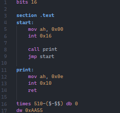
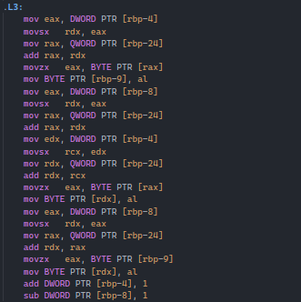
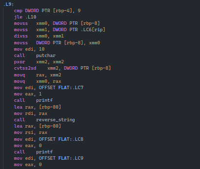

## Features

* First Image - A basic real mode program that reads input and prints it out on the screen
* Second Image - Assembly code generated by gcc with intel syntax (Note that this image is generating for the GNU assembler, so it's not completely compatible)
* Third Image - More gcc generated code

## Known Issues

- None at the moment
